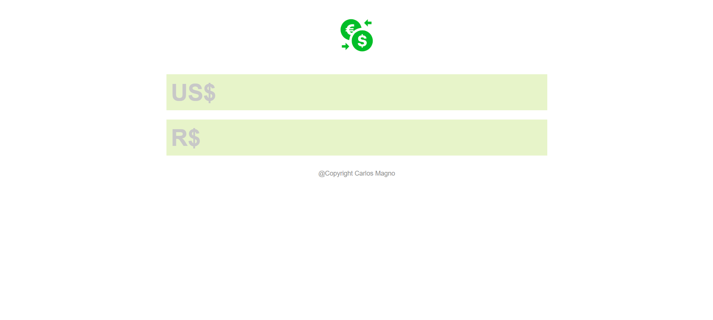

<h1 align="center"> Conversor de Moedas </h1>

Projeto exclusivo de minha autoria.

 

  

## 🚀 Tecnologias

Esse projeto foi desenvolvido com as seguintes tecnologias:

- HTML e CSS
- JavaScript
- Git e Github

## 💻 Projeto

O Projeto se trata de um conversor de moedas de Dolar para Real Brasileior.